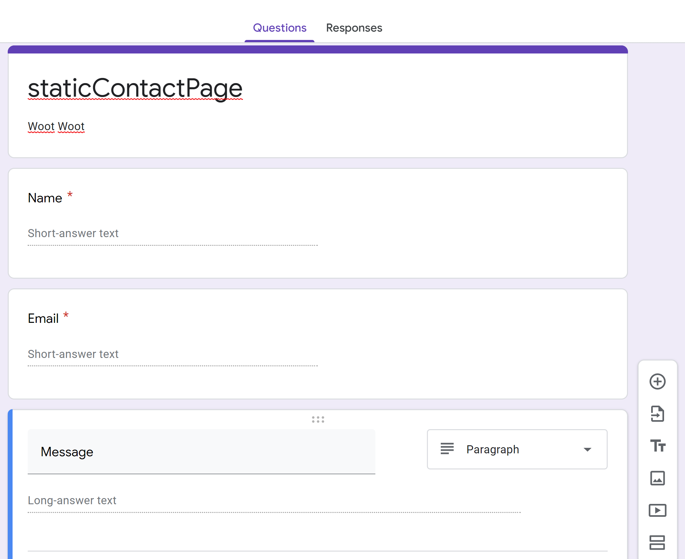
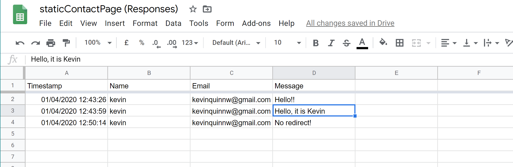
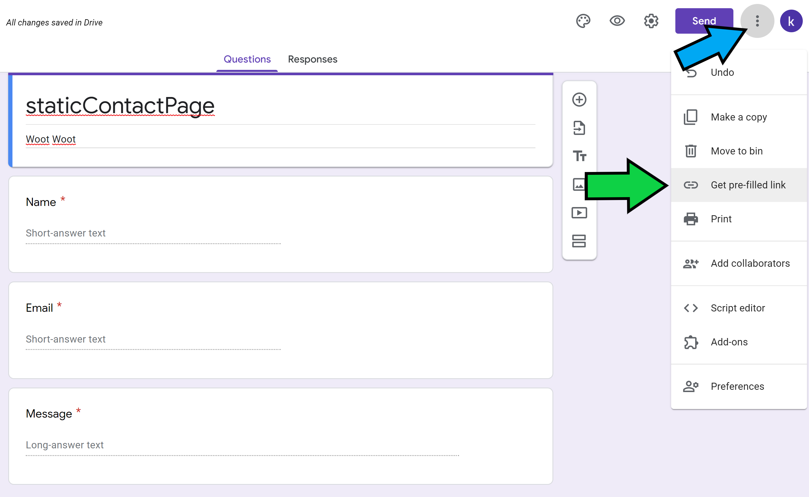

# staticContactPage
A tutorial on how to create a functional contact page with google forms, and HTML.

# Task 
I have heard of so many ways to create a contact page with static websites and I have found that this is the easiest way. 

### Our steps are:
1. Create your html form
2. Create a google form
3. Snag some code from the form 
4. Make the redirect hidden with JavaScript and iframe

# Create HTML Form 
#### Make it basic, we will go back to it later.

```html 
<form>

    <p>Name</p>
    <input placeholder="Name" type="text" required>

    <br>

    <p>Email</p>
    <input placeholder="Email" type="email" required>

    <br>
    
    <p>Message</p>
    <textarea placeholder="Comment"></textarea><br>
    
    <br>

    <button type="submit">Send</button>
  
</form>
```

# Create a Google Form 

## Create a google form and add as many questions as you like.


## Link it to a spreadsheet, to collect responses.


This allows you to see when people have messaged you, and all the other questions you asked for.

## Get the prefilled link.


### We will extracting the entry values from the link and using it for our form. You will have to fill out the form, submit it, then copy the link.

```
https://docs.google.com/forms/d/e/1FAIpQLScOS65F0ZSyiyFeC2y4X1Y76YIg-HYgFgWhmeawIi-uFcauTQ/viewform?usp=pp_url&entry.1804520491=cskbotboi&entry.1428655783=cskbotboi@gmail.com&entry.877185975=Hello!
```

### Adding code. 
In the url, your entry will be equal to what you typed out on the survey. 

## Add the following to your form tag.

### Note: For the action part, erase up to "viewform?" piece of the URL and put formResponse?. 

```html 
<form name="gooform" id="gooform" enctype="text/plain" action ="https://docs.google.com/forms/d/e/1FAIpQLScOS65F0ZSyiyFeC2y4X1Y76YIg-HYgFgWhmeawIi-uFcauTQ/formResponse?" target ="hidden_iframe" onsubmit="submitted=true;">
```

## Name, Email, Message, Field's
```html
    <p>Name</p>
    <input id="entry.1804520491" name="entry.1804520491" placeholder="Name" type="text" required>

    <br>

    <p>Email</p>
    <input id="entry.1428655783" name="entry.1428655783" placeholder="Email" type="email" required>

    <br>
    
    <p>Message</p>
    <textarea id="entry.877185975" name="entry.877185975" placeholder="Comment"></textarea><br>
```


### It should all look like this. 
```html 
<form name="gooform" id="gooform" enctype="text/plain" action ="https://docs.google.com/forms/d/e/1FAIpQLScOS65F0ZSyiyFeC2y4X1Y76YIg-HYgFgWhmeawIi-uFcauTQ/formResponse?" target ="hidden_iframe" onsubmit="submitted=true;">

    <p>Name</p>
    <input id="entry.1804520491" name="entry.1804520491" placeholder="Name" type="text" required>

    <br>

    <p>Email</p>
    <input id="entry.1428655783" name="entry.1428655783" placeholder="Email" type="email" required>

    <br>
    
    <p>Message</p>
    <textarea id="entry.877185975" name="entry.877185975" placeholder="Comment"></textarea><br>
    
    <br>

    <button class="" type="submit">Send</button>
  
</form>
```

## Redirect 
If you want a redirect back to google forms, it will look like this whenever someone submits the form. 


## No Redirect
If you want no redirect add an iframe tag.

### iframe tag
```html
<iframe name="hidden_iframe" id="hidden_iframe" style="display:none;" onload="if(submitted) {}"></iframe>
```
This will hide the redirect.

## Message Fade-in
IF you want a message to fade in after they've completed the survery add the following code to your HTML document.
    
### JavaScript 
```html 
<script src="assets/js/jquery.min.js"></script>
<script type="text/javascript">var submitted=false;</script>
<script type="text/javascript">
$('#gooform').on('submit', function(e) {
  $('#gooform *').fadeOut(2000);
  $('#gooform').prepend('Thank you for contacting me! Looking forward to connecting with you.');
  });
</script>
```
This will fade in a message saying: "Thank you for contacting me! Looking forward to connecting with you." 

# That's ALL. 
Test it out for yourself and make sure everything is working, best of luck. Feel free to contact me at kevinquinnw@gmail.com for any questions
